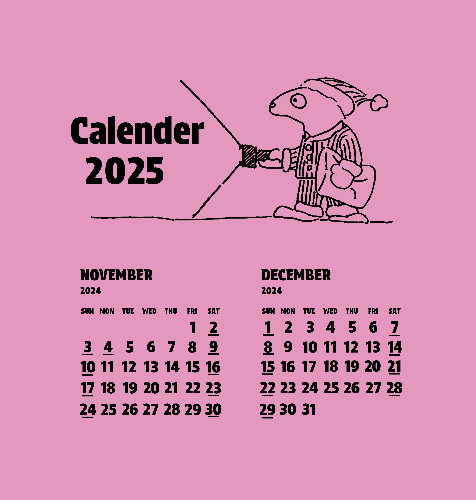

# デザインサークル活動作品

このレポジトリは、学科内の「チーム出the印サークル」での活動を通じて制作した作品をまとめたものです。
 
 

## ▼しおりの回

本のしおりのデザインを手がけました。テーマは自由だったため、3枚セットのシリーズにし、さまざまな種類のウミウシをIllustlatorのベジェ曲線を用いて作りました。カラフルで明るく優しい色合いにし、ウミウシの種類ごとの違いにわくわくしたり、可愛さに癒されるようなデザインになるよう心がけました。
 
 

## ▼カレンダーの回

 

カレンダーのデザインを手がけました。以前絵を描いているときに思いついたキャラクターを主役にし、アナログイラストを作成しスキャンして取り込みました。「アメリカの日常風景やイベント」をテーマにイラストの場面を考えており、季節ごとの違いを楽しみながらも、キャラクターの自由気ままな様子に癒される作品を目指しました。
 
 
また、学園祭のグッズ販売では小型化したカレンダーシールを販売し、購入していただくことができました。
